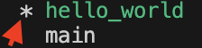

# PiTCRU

Screenshots

List of Technologies Used

Installation Instructions Used

Unsolved Problems and Development Hurdles

Prep Materials

 
Trello Board 
Wireframes 
ERD

How we git

<h2>Feature Branch Workflow</h2>
We implement a feature branch workflow, the rules of which include:  
<ul>
	<li>All development work by a team member will be completed in a descriptively named feature branch</li>
	<li>Development work will only be added to the main project through branch merge pull requests</li>
	<li>All discussion and decision making will be tracked in pull request comments</li>
</ul>
<h2>Instructions</h2>
<ol>
	<li>
		

			
Review assigned ticket from Trello board

			  
		

	</li>
	<li>Navigate to local repo in terminal</li>
	<li>
		

			
Refresh local main branch

			First, ensure your main branch is checked out by simply running the following <pre>git checkout main</pre>
			Next, sync your local main branch to the remote main branch by running the following <pre>git pull</pre>
			Next, output the status of your repo by running the following <pre>git status</pre>
			Finally, observe the output and check that your branch is up to date by confirming the following text appears in your git status output   
		

	</li>
	<li>
		

			
Create New Feature Branch

			Run the following with no square brackets where new_branch_name is a descriptive name that correlates to your assigned Trello ticket<pre>git branch [new_branch_name]</pre>
			Set your local working branch to your new feature branch by running the following <pre>git checkout [new_branch_name]</pre>
			List all your branches created for this repo by running the following <pre>git branch</pre>
			Confirm your new feature branch is selected by ensuring it appears in the output list and has an asterisk next to it    
			Set your upstream branch by running the following <pre>git push -u origin <[new_branch_name]</pre>
			Push new branch to Github by running the following <pre>git push --set-upstream origin [new_branch_name]</pre>
			Check remote repository and assure new branch now appears in the list   
			<strong>CONTACT GIT GUY IMMEDIATELY IF YOU RUN INTO ISSUES YOU DO NOT KNOW HOW TO RESOLVE</strong>
		

	<li>
		

			
Develop Code in New Branch to Meet Trello Ticket Requirements

			Complete all development work in this branch (write functionality piece by piece and add, stage, commit between getting each piece working!)
			<ul>
				For reference, here are the comments to 1. stage, 2. commit, and 3. push
				<li>Stage changes by running <pre>git add -A</pre>
				<li>Commit changes by running <pre>git commit -m "commit message"</pre></li>
				<li>Push changes by running<pre>git push</pre></li>
			</ul>
			<strong>CONTACT GIT GUY IMMEDIATELY IF YOU RUN INTO ISSUES YOU DO NOT KNOW HOW TO RESOLVE</strong>
		

	</li>
	<li>
		

			
Submit Pull Request and Notify Reviewers

			Run the following <pre>git log</pre>
			Compare log output to remote branch commit history and ensure the most recent commit IDs match   
			If remote repo not up to date, refer to step 5 to stage, commit, and push changes. 
			Once local and remote branches are sync'd, submit pull request     
			Notify reviewer(s) via Discord group chat that PR is ready for review  
			<strong>CONTACT GIT GUY IMMEDIATELY IF YOU RUN INTO ISSUES YOU DO NOT KNOW HOW TO RESOLVE</strong>
		

	</li>
</ol>
<strong>NOTE:</strong> All discussion regarding PRs must be logged in PR comments. If voice call is necessary to resolve certain topics, one of the attendees of that conversation must include notes from the conversation as a comment in the PR. Merge conflicts should also be handled in the Github PR UI, and should always be handled by at least two people.</li>

How we Seed

<h2>Follow the following steps</h2>
<ul>
	<li>First make sure there isnt any changes that havent been migrated<pre>python3 manage.py makemigrations</pre>
	<li>Migrate any changes that may be pending<pre>python3 manage.py migrate</pre>
	<li>Drop your db through the terminal<pre>dropdb pitcru</pre>
	<li>Create your db through the terminal<pre>createdb pitcru</pre>
	<li>If you dont have requests folder download using the follow<pre>pip3 install requests</pre>
	<li>Enter the python shell<pre>python3 manage.py shell</pre>
	<li>Import the main app models folder <pre>from main_app.models import *</pre>
	<li>Run the seeding function <pre>seed_db()</pre>
<ul>